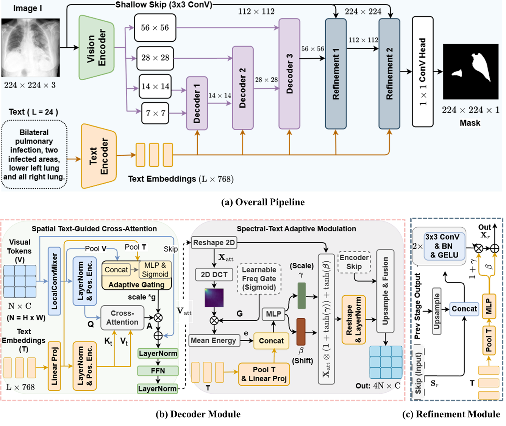

# DD-CMD | [Paper link](https://arxiv.org/abs/2608.11335) | MICCAI2026

**Dual-Domain Cross-Modal Decoding for Clinical Text-Guided Medical Image Segmentation (DD-CMD)** has been accepted to MICCAI2026. This is the official implementation of DD-CMD.

---
<p align="center">  </p>

---

## Environment Setup

Please create a Python 3.8 environment first, then install the required dependencies from `requirements.txt`.

```bash
conda create -n dd-cmd python=3.8 -y
conda activate dd-cmd
pip install -r requirements.txt
```

You may also use another environment manager if preferred, but the repository is prepared for **Python 3.8**.

## Dataset Preparation

This project uses the following datasets:

### 1. QaTa-COV19
Original source: [QaTa-COV19 on Kaggle](https://www.kaggle.com/datasets/aysendegerli/qatacov19-dataset)

### 2. MosMedData+
Original source: [MosMedData+](http://medicalsegmentation.com/covid19/)

### 3. Text Annotations
The text annotations for **QaTa-COV19** and **MosMedData+** can be obtained from the related resources provided in **LViT**:

[https://github.com/HUANGLIZI/LViT](https://github.com/HUANGLIZI/LViT)

We thank **Li et al.** for making these resources available. If you use the dataset annotations or related materials, please cite their work accordingly.

## Pretrained Backbones

This repository relies on pretrained vision and language backbones. You can download them from the following links:

### Vision Backbone
- **ConvNeXt-Tiny**: [facebook/convnext-tiny-224](https://huggingface.co/facebook/convnext-tiny-224/tree/main)

### Language Backbone
- **PubMedBERT/BiomedBERT**: [microsoft/BiomedNLP-BiomedBERT-base-uncased-abstract-fulltext](https://huggingface.co/microsoft/BiomedNLP-BiomedBERT-base-uncased-abstract-fulltext)

## Configuration

Model and training settings can be modified in:

```bash
config/train.yaml
```

The main encoder settings used for this model are:

```yaml
vision_type: facebook/convnext-tiny-224
bert_type: microsoft/BiomedNLP-BiomedBERT-base-uncased-abstract-fulltext
```

Please ensure the dataset paths, checkpoint paths, and any runtime options in `config/train.yaml` are correctly configured before launching training or evaluation.

## Training

We use PyTorch Lightning for training.

Run the following command to train the model:

```bash
python train.py --config ./config/train.yaml
```

## Evaluation

Use the following commands to evaluate the trained model.
- The pretrained model checkpoints are available and will be publicly shared later. Until then, please contact the authors or create an issue if you need access for reproduction or research purposes.

### MosMedData+ Dataset

```bash
python evaluate.py --config ./config/train.yaml --ckpt ./pretrained_models/MosMedplus.ckpt
```

### QaTa-COV19 Dataset

```bash
python evaluate.py --config ./config/train.yaml --ckpt ./pretrained_models/QaTa-Covid19.ckpt
```

## Notes
- Ensure that all dataset files and text annotations are placed in the correct locations expected by the configuration file.
- If you use custom checkpoints, replace the `--ckpt` path with the path to your own saved model.
- The provided configuration file can be adjusted for batch size, learning rate, dataset paths, and other experiment settings.

## Acknowledgment

We thank the authors of [**LViT**](https://github.com/HUANGLIZI/LViT) for making their code, dataset, and related resources publicly available.

## Citation

If you find this repository helpful, please consider citing our paper. When appropriate, please also cite the relevant dataset and annotation sources.

```bibtex
@article{rahman2026ddcmd,
  title={Dual-Domain Cross-Modal Decoding for Clinical Text-Guided Medical Image Segmentation},
  author={Rahman, Md Maklachur and Hammond, Tracy},
  journal={arXiv preprint arXiv:2608.11335},
  year={2026}
}
```
